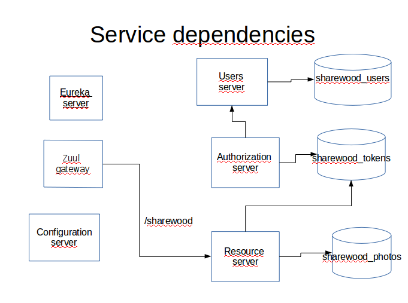
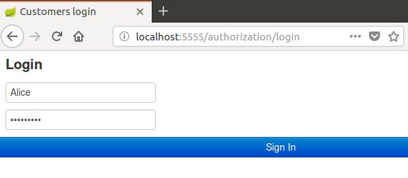
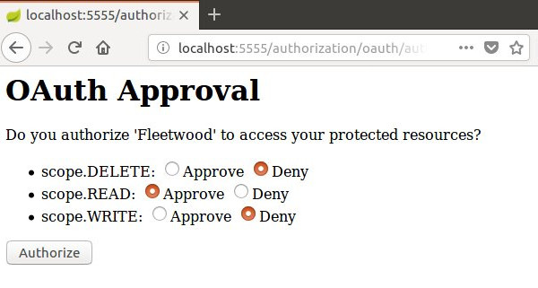

# sharewood-reloaded
I present here a microservice-oriented version of the previous project https://github.com/dubersfeld/sharewood-boot-oauth2. It uses Zuul as a reverse proxy.

Here are the prerequisites for running the complete application:

Any Linux platform (I use Ubuntu 16.04)

A recent MySQL server installed

A recent Apache Maven version installed (I used 3.3.9)

In addition I used Spring Tool Suite for developing this demo but it is not required for running the application.

The complete application is comprised of an OAuth2 authorization server and an OAuth2 resource server. The resource server is hidden behind a reverse proxy. The authorization server is not.

A separate Eureka server is used to register the resource server.

An additional user server is used to provide user authentication needed for Authorization Code Grant.

A separate Spring Cloud configuration server sets all deployment configuration properties for the three servers and the gateway that all have spring-cloud-config-client dependency. It fetches properties from the local file system. All configuration YAML files are stored in the subdirectory config-repo.

Three separate databases are used to persist Oauth2 tokens, photos and users.

The dependencies are summarized on figure below:




Project name         | Application name | Port | Database                             | Routing
-------------------  | ---------------- | ---- | -------------------------------------| -------------------------
authorization-server | authorization    | 8080 | sharewood\_tokens                    |
sharewood-resource   | sharewood-server | 8081 | sharewood\_tokens, sharewood\_photos | sharewood
sharewood-config     |                  | 8888 |                                      |
sharewood-gateway    | zuul-service     | 5555 |                                      |
user-server         | users-service    | 9090 | sharewood\_users                     |
eureka-service       |                  | 8761 |                                      |

Here are the steps to run the application.

## 1. Database creation

In folder sql connect to MySQL client and run the commands:
```
SOURCE sharewoodTokenDB2019.sql
SOURCE sharewoodPhotoDB2019.sql
SOURCE sharewoodUserDB2019.sql
```

This creates three databases named sharewood\_tokens, sharewood\_photos and sharewood\_users.

## 2. JAR files creation

In each project directory:
1. config-server
1. eureka-service
1. user-server
1. authorization-server
1. sharewood-resource
1. sharewood-gateway
1. fleetwood

run the Maven command:
```
mvn clean package
```

 
## 3. Launching the application

In each project directory (following the sequence)
1. config-server
1. eureka-service
1. user-server
1. authorization-server
1. sharewood-resource
1. sharewood-gateway
1. fleetwood

run the Maven command:
```
mvn spring-boot:run
```

Now you can login to the fleetwood client on port 8090. Once logged the user can execute all RESTful request after authenticating to the authorization server and granting to fleetwood the required scope.

The users server is populated with two users Alice and Carol who have the role USER. Their passwords are:
Alice: o8p7e6r5a
Carol: s1a2t3o4r

Now the user is presented the authentication page and approval page shown below. Note that the only port exposed is the proxy port 5555.




Note: it takes some time for the routes to be taken into account. With default settings it takes about 2 minutes. If you connect to the resource server or to the authorization server too early you will only see an error message.

The most tricky part of this project was to force the correct redirection after a successful login to authentication-server. This is achieved by subclassing the beans AuthenticationSuccessHandler and ExceptionTranslationFilter in authentication-server.

Another point of interest is that the resource server connects to two different databases. This is achieved by creating a separate configuration file for each database.


